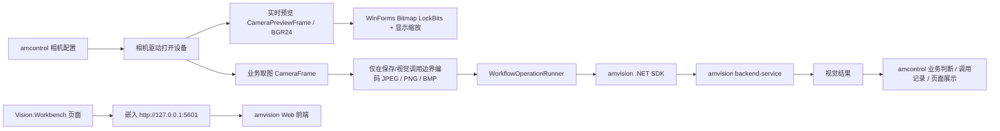

# 视觉、相机与 amvision SDK 集成规划

**文档编号**：FEAT-VISION-001
**版本**：1.0.0
**状态**：有效
**最后更新**：2026-07-06
**维护人**：Am

---

## 1. 文档定位

本文档是 `AMControlWinF` 后续实现“相机配置 + 视觉 SDK 调用 + amvision 前端嵌入”的规划基线，用于约束后续开发边界，避免把相机配置、视觉工作流管理和第三方视觉平台职责混在一起。

当前代码状态：

- `Libsrc/amvision/src/Amvision.Workflows` 已放入本仓库，作为 amvision .NET SDK 源码；
- `Libsrc/amvision/apps/Amvision.Workflows.Net461Console` 已放入本仓库，作为 .NET Framework 4.6.1 现场调用封装参考；
- `Libsrc/amvision/apps/Amvision.Workflows.Net461Console/Config` 是实际视觉调用配置来源；
- `SysConfig.Camera` 已开始按本文档落地，当前已接入 OpenCvSharp + DSHOW 通用 USB 相机配置、枚举、打开、设置页、单帧取图和测试图保存入口；
- `Vision.Workbench / Vision.Debug / Vision.Record` 已完成导航规划，具体页面仍按后续阶段推进。

本文档描述的是下一阶段实现目标，不等同当前已完成实现。当前事实仍以代码和 [开发进展记录](../07-release-notes/winf-development-progress.md) 为准。

---

## 2. 总体边界

### 2.1 amcontrol 职责

`amcontrol` 是设备控制软件，负责设备侧相机和业务链路：

- 管理本项目内的相机配置；
- 打开相机、取图、预览和测试；
- 将相机帧编码为适合 SDK 调用的图片 bytes、base64 或文件；
- 调用 `Libsrc/amvision` 中的 .NET SDK / `WorkflowOperationRunner`；
- 获取视觉结果并参与本项目业务判断；
- 保存本项目发起的视觉调用记录；
- 将 `http://127.0.0.1:5601` 的 amvision 前端嵌入为工作台入口，减少窗口切换。

### 2.2 amvision 职责

`amvision` 是独立视觉项目，负责视觉平台能力：

- 创建和维护 workflow app、runtime、TriggerSource；
- 管理视觉节点、模型、部署、推理和结果展示；
- 保存视觉调用所需的 backend、token、runtime、TriggerSource、ZeroMQ endpoint 等配置；
- 提供 Web 前端和 .NET SDK。

### 2.3 禁止混淆的内容

后续实现中必须避免以下设计：

- 不在相机配置中绑定 `workflow_runtime_id` 或 `trigger_source_id`；
- 不建立 `camera -> workflow runtime / trigger source` 绑定表；
- 不在 `amcontrol` 的 `config.json` 中重复保存 `DefaultAccessToken`、`DefaultZeroMqEndpoint`、runtime id、TriggerSource id；
- 不在 `SysConfig.Camera` 页面展示 amvision runtime / TriggerSource 绑定状态；
- 不在 `amcontrol` 里重做 amvision 的 workflow 创建、节点编辑、标定、部署和推理页面；
- 不把海康、康耐视等厂商 SDK 相机统称为“工业相机”，应按厂商 SDK 或驱动类型区分。

---

## 3. 运行链路



其中：

- 相机配置和取图完全属于 `amcontrol`；
- workflow app、runtime、TriggerSource 和视觉配置完全属于 `amvision`；
- 两者只通过 SDK 调用参数和返回结果发生关系；
- 前端嵌入只是操作便利性，不改变业务边界。

### 3.1 图像性能边界

- 实时预览必须从 `JPEG/PNG/BMP` 编码链路中拆出，使用 `CameraPreviewFrame` 保存相机实际分辨率的 BGR24 像素数据，WinForms 端通过 `Bitmap.LockBits` 写入；
- 工业应用中实时预览不得为了适配窗口先缩放采集帧，避免对分辨率、视野和细节判断造成偏差；
- 预览窗口只做显示层缩放：默认将原始分辨率图像等比 Fit 到窗口，右下角提供放大/缩小按钮，并支持鼠标滚轮按指针位置缩放；
- `CameraFrame` 只用于手动取图保存、视觉 SDK 调用和后续业务调用，避免预览每帧都做 `Cv2.ImEncode`、`Image.FromStream` 和 GDI+ 解码；
- 当前 `Libsrc/amvision` SDK 的调用边界是 `byte[] imageBytes + mediaType`，本项目不能直接把 C# `Bitmap` 传给视觉后端；
- 内部相机运行层可以保留 OpenCV `Mat` / BGR24 原始帧，但进入 SDK 前仍需要编码一次；
- OpenCV `Cv2.ImEncode` 直接从 `Mat` 编码通常比 `Mat -> Bitmap -> GDI+ Save` 更适合本项目链路；
- `PNG` 压缩开销最大，适合需要无损且低频的调试场景；`JPEG` 有压缩开销但传输体积小，默认适合高分辨率视觉调用；`BMP` 编码开销低但体积大，只有在本机传输、后端明确支持 `image/bmp` 且实测总耗时更低时才作为性能选项。

---

## 4. SDK 集成方式

### 4.1 首选入口

后续 `amcontrol` 不应直接从页面调用底层 HTTP 或 ZeroMQ SDK，而应优先使用：

```text
Amvision.Workflows.Net461Console.WorkflowOperationRunner
```

该类已经封装：

- `Config/config_*.json` 加载；
- runtime key 和 TriggerSource key 字典；
- HTTP `AmvisionWorkflowClient` 复用；
- ZeroMQ `AmvisionTriggerClient` socket 复用；
- 图片 file / base64 / bytes 调用；
- runtime / TriggerSource health、start、stop、list 等现场调试方法。

典型调用入口：

```text
WorkflowOperationRunner.CreateDefault()
WorkflowOperationRunner.RuntimeNames
WorkflowOperationRunner.TriggerSourceNames
InvokeZeroMqImageBytesAsync(triggerSourceName, imageBytes, mediaType)
InvokeRuntimeAppResultWithImageBytesAsync(runtimeName, imageBytes, mediaType)
```

### 4.2 配置来源

amvision 调用配置只来自：

```text
Libsrc/amvision/apps/Amvision.Workflows.Net461Console/Config/config_*.json
```

后续构建或发布时，应保证这些 `config_*.json` 被复制到主程序输出目录的 `Config` 目录，使 `WorkflowConfigLoader` 能按默认查找规则读取。

`amcontrol` 不解析、不复制存储、不二次维护这些字段：

- `base_api_url`
- `access_token`
- `project_id`
- `workflow_runtime_id`
- `trigger_source_id`
- `bind_endpoint`
- `default_input_binding`
- `timeout_seconds`

如果未来需要支持现场修改这些参数，应优先修改 `amvision` Console 配置文件或由 amvision 前端维护，不在 `amcontrol` 中新增重复配置页。

### 4.3 调用模式选择

现场高频图片推理优先使用 ZeroMQ：

```text
InvokeZeroMqImageBytesAsync(triggerSourceName, imageBytes, "image/jpeg")
```

原因：

- 图片 bytes 作为 ZeroMQ multipart 第二帧传递；
- `WorkflowOperationRunner` 会复用 TriggerSource key 对应的 SDK client；
- 适合设备侧相机实时取图后的推理调用。

HTTP app-result 调用保留为同步调试或低频业务调用：

```text
InvokeRuntimeAppResultWithImageBytesAsync(runtimeName, imageBytes, "image/jpeg")
```

### 4.4 图片转换

`Libsrc/amvision/apps/Amvision.Workflows.Net461Console/Tools/ImageConversionTools.cs` 已提供以下能力：

- `Bitmap -> JPEG/PNG/BMP bytes`
- `Bitmap -> base64 / data URL`
- `file -> bytes/base64/data URL`
- `base64/data URL -> Bitmap`

`amcontrol` 相机驱动层只需要稳定输出编码后的 `byte[]`，再由视觉调用服务转换为 SDK 入参。第一阶段 USB 相机取图已确定使用 OpenCvSharp `VideoCapture` + `DSHOW` 后端，参数设置顺序贴近现场验证过的 Python OpenCV 脚本：先设置 `MJPG`，再设置 FPS、分辨率，最后重复设置一次 `MJPG`。

---

## 5. 相机配置规划

### 5.1 类型命名

第一阶段默认实现通用 USB 相机，运行实现为 OpenCvSharp + DSHOW，不把 UVC 高分辨率/高帧率能力作为默认假设。

后续厂商 SDK 相机按驱动类型预留，不使用笼统“工业相机”命名：

```text
Usb
Amvar
HikvisionMvs
Cognex
Daheng
VendorSdk
Virtual
```

### 5.2 相机表规划

规划新增表：

```text
device_camera_config
```

字段方向：

| 字段 | 说明 |
|------|------|
| `Id` | 主键 |
| `CameraCode` | 相机编码，业务侧唯一标识 |
| `CameraName` | 相机名称 |
| `DriverType` | 驱动名称，第一阶段默认 `Usb`；当前实现为 OpenCvSharp DSHOW |
| `IsEnabled` | 是否启用 |
| `DeviceIndex` | OpenCV DSHOW 设备索引 |
| `DevicePath` | USB 相机设备路径或 moniker，OpenCV 第一阶段可为空 |
| `FriendlyName` | 系统枚举名称 |
| `Width` | 采集宽度 |
| `Height` | 采集高度 |
| `Fps` | 采集帧率 |
| `PixelFormat` | 像素格式 |
| `Exposure` | 曝光参数 |
| `Gain` | 增益参数 |
| `GrabTimeoutMs` | 取图超时 |
| `ImageFormat` | SDK 调用前的编码格式，默认 JPEG |
| `JpegQuality` | JPEG 质量 |
| `PreviewFps` | 页面预览帧率，默认等于相机 FPS，不能高于相机 FPS |
| `SaveImageEnabled` | 是否在手动点击“取图”时保存当前帧；定时预览不自动落盘 |
| `SaveImageDirectory` | 手动取图保存目录，支持相对主程序输出目录的路径 |
| `Remark` | 备注 |
| `CreateTime` | 创建时间 |
| `UpdateTime` | 更新时间 |

禁止在该表中加入：

- `WorkflowRuntimeId`
- `TriggerSourceId`
- `ZeroMqEndpoint`
- `AccessToken`
- `ProjectId`
- `ApplicationId`

### 5.3 相机运行抽象

已新增相机运行抽象：

```text
AM.Model/Camera/CameraDeviceInfo.cs
AM.Model/Camera/CameraFrame.cs
AM.Model/Camera/CameraPreviewFrame.cs
AM.Model/Interfaces/Camera/ICameraRuntimeService.cs
AM.CameraService/OpenCv/OpenCvCameraRuntimeService.cs
```

第一阶段目标：

- 可枚举 OpenCV DSHOW 可打开的 USB 相机索引；
- 可保存相机基础参数；
- 可打开/关闭指定相机；
- 可打开相机驱动设置页，用于现场确认 MJPG、分辨率和帧率；
- 可单帧取图；
- 可将业务取图编码为 `image/jpeg` / `image/png` / `image/bmp` + `byte[]`；
- 可使用 BGR24 预览帧进行页面实时预览；
- 可在手动取图时测试保存图片。

---

## 6. 视觉导航规划

当前早期规划中的以下页面 key 已不再适合作为后续实现目标：

```text
Vision.Monitor
Vision.Result
Vision.Calibrate
```

后续实现应调整为：

```text
SysConfig
└── SysConfig.Camera      相机配置

Vision
├── Vision.Workbench      视觉工作台
├── Vision.Debug          视觉调试
└── Vision.Record         视觉记录
```

### 6.1 SysConfig.Camera

职责：

- OpenCvSharp + DSHOW 通用 USB 相机配置；
- 相机枚举；
- 打开/关闭；
- 单帧取图；
- 预览；
- 测试保存图片；
- 厂商 SDK 相机类型预留。

不负责：

- 不管理 amvision runtime；
- 不管理 TriggerSource；
- 不选择 workflow app；
- 不保存 token、endpoint 或 workflow id。

### 6.2 Vision.Workbench

职责：

- 嵌入 `http://127.0.0.1:5601`；
- 提供刷新、重新加载、外部浏览器打开等基础操作；
- 作为 amvision 前端工作台入口。

不负责：

- 不理解 amvision 内部路由；
- 不重做节点编辑、模型、数据集、部署、推理、标定页面。

### 6.3 Vision.Debug

职责：

- 选择本项目相机；
- 取图并展示输入图片；
- 从 `WorkflowOperationRunner.RuntimeNames` 和 `TriggerSourceNames` 读取可用调用 key；
- 选择 ZeroMQ Trigger 或 HTTP Runtime AppResult 调用；
- 调用 SDK；
- 展示耗时、返回 JSON、错误信息和关键结果字段；
- 可保存一条本项目视觉调用记录。

### 6.4 Vision.Record

职责：

- 查询本项目发起的视觉调用历史；
- 按时间、相机、调用方式、成功状态筛选；
- 查看输入图片路径、耗时、结果 JSON、异常信息；
- 支撑现场追溯和调试。

---

## 7. 视觉调用记录

规划新增表：

```text
vision_call_record
```

字段方向：

| 字段 | 说明 |
|------|------|
| `Id` | 主键 |
| `CameraId` | 本项目相机配置 id |
| `CameraCode` | 调用时的相机编码快照 |
| `CallMode` | `ZeroMqTrigger` / `HttpRuntimeAppResult` |
| `RuntimeName` | 传给 `WorkflowOperationRunner` 的 runtime key |
| `TriggerSourceName` | 传给 `WorkflowOperationRunner` 的 TriggerSource key |
| `ImagePath` | 可选，调用图片保存路径 |
| `MediaType` | 图片 media type，如 `image/jpeg` |
| `ImageBytesLength` | 图片字节数 |
| `RequestTime` | 调用开始时间 |
| `ElapsedMs` | SDK 调用耗时 |
| `IsSuccess` | 是否成功 |
| `State` | SDK 返回状态 |
| `WorkflowRunId` | SDK 返回的 workflow run id，若有 |
| `ResponseJson` | 返回 JSON 或序列化结果 |
| `ErrorMessage` | 异常信息 |
| `OperatorUserId` | 操作用户 |
| `StationCode` | 工位编码，业务侧可选 |
| `ProductCode` | 产品/条码，业务侧可选 |
| `CreateTime` | 创建时间 |

该表只记录 `amcontrol` 发起的调用历史，不承担 amvision 调用配置职责。

---

## 8. 推荐分层

### 8.1 Model 层

已新增或规划使用：

```text
AM.Model/Entity/Device/CameraConfigEntity.cs
AM.Model/Entity/Vision/VisionCallRecordEntity.cs
AM.Model/Vision/CameraDriverType.cs
AM.Model/Vision/VisionCallMode.cs
AM.Model/Camera/CameraFrame.cs
AM.Model/Vision/VisionInvokeResult.cs
```

### 8.2 Service 层

相机配置 CRUD 和调用记录持久化可放入 `AM.DBService`：

```text
AM.DBService/Services/Camera/CameraConfigCrudService.cs
AM.DBService/Services/Vision/VisionCallRecordService.cs
```

相机驱动和视觉 SDK 调用独立成服务层：

```text
AM.CameraService
AM.VisionService
```

`AM.CameraService` 用于承接：

- 相机驱动抽象；
- OpenCvSharp + DSHOW 通用 USB 相机实现；
- 单帧取图和图像编码。

`AM.VisionService` 用于承接：

- `WorkflowOperationRunner` 生命周期；
- SDK 调用；
- 结果转换。

### 8.3 UI 层

WinForms 页面继续遵循当前模式：

```text
UserControl Page
  ├── PageModel
  ├── Crud / Runtime / Invoke Service
  └── 定时刷新或按钮触发
```

页面不直接访问相机 SDK、ZeroMQ client 或 amvision HTTP client。

---

## 9. 实施步骤

### 9.1 第一阶段：文档与导航基线

1. 将本文档作为视觉/相机实现基线；
2. 调整 `NavigationCatalog` 中视觉页面 key；
3. 注册新的页面工厂占位；
4. 维持 `SysConfig.Camera` 作为相机配置入口。

### 9.2 第二阶段：相机配置

1. 新增 `device_camera_config` 实体和表初始化；
2. 新增相机配置 CRUD；
3. 实现 `SysConfig.Camera` 页面；
4. 支持 OpenCV DSHOW 枚举、保存、打开、设置页、预览、单帧取图。

### 9.3 第三阶段：SDK 调用封装

1. 确认 `Libsrc/amvision` 与当前旧式 `.csproj` 的引用方式；
2. 保证 `Config/config_*.json` 能进入主程序输出目录；
3. 长期持有 `WorkflowOperationRunner`；
4. 封装 `VisionInvokeService`；
5. 支持 ZeroMQ 图片 bytes 调用和 HTTP app-result 调试调用。

### 9.4 第四阶段：视觉页面

1. `Vision.Workbench` 嵌入 amvision 前端；
2. `Vision.Debug` 完成“取图 -> SDK 调用 -> 结果展示”；
3. `Vision.Record` 完成调用历史查询。

### 9.5 第五阶段：业务接入

1. 在设备业务动作中选择相机；
2. 取图并调用视觉；
3. 根据视觉结果继续执行动作、报警或记录；
4. 将调用记录纳入现场追溯。

---

## 10. 构建与兼容注意事项

当前主项目是旧式 `.NET Framework 4.6.1` 项目，主要代码使用 C# 7.3。`Libsrc/amvision` 中 SDK 和 Console 封装是 SDK-style 项目，并使用较新的语言版本设置。

后续落地引用方式前需要确认：

- 旧式 `.csproj` 是否能直接 `ProjectReference` 到 `Libsrc/amvision` 的 SDK-style 项目；
- 构建环境是否具备 SDK-style 项目需要的 .NET SDK；
- `NetMQ`、`System.Text.Json` 等依赖如何进入主程序输出目录；
- `Config/config_*.json` 如何复制到 `AMControlWinF` 输出目录；
- Web 前端嵌入采用 WebView2、CefSharp 还是外部浏览器兜底。

若 WebView2 与 `.NET Framework 4.6.1` 不兼容，应优先评估升级到 `.NET Framework 4.6.2 / 4.7.2` 或使用 CefSharp。旧 WinForms `WebBrowser` 控件不适合作为 Vue/Vite 现代前端的正式宿主。

---

## 11. 实现验收清单

实现过程中至少满足以下条件：

- `SysConfig.Camera` 页面只管理本项目相机；
- 相机配置表中没有 amvision workflow/runtime/TriggerSource 配置字段；
- amvision SDK 调用参数来自 `Libsrc/amvision/.../Config/config_*.json`；
- `amcontrol` 不新增重复的 token、endpoint、runtime id、TriggerSource id 配置；
- `Vision.Workbench` 只是嵌入 amvision 前端；
- `Vision.Debug` 通过相机取图后调用 SDK；
- `Vision.Record` 只保存本项目调用历史；
- 高频调用优先使用 `InvokeZeroMqImageBytesAsync`；
- 页面层不直接 new amvision SDK client；
- 业务服务长期持有并复用 `WorkflowOperationRunner`。

---

## 相关文档

- [AMControlWinF 导航系统与页面缓存](../01-architecture/winf-navigation-system.md)
- [AMControlWinF 项目总览](../02-development/winf-project-overview.md)
- [数据库与配置文档](../09-database-config/README.md)
- [第三方依赖说明](../08-third-party/README.md)
- [AMControlWinF 开发进展](../07-release-notes/winf-development-progress.md)
